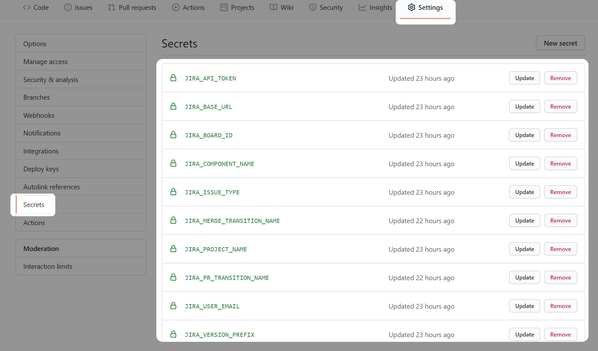
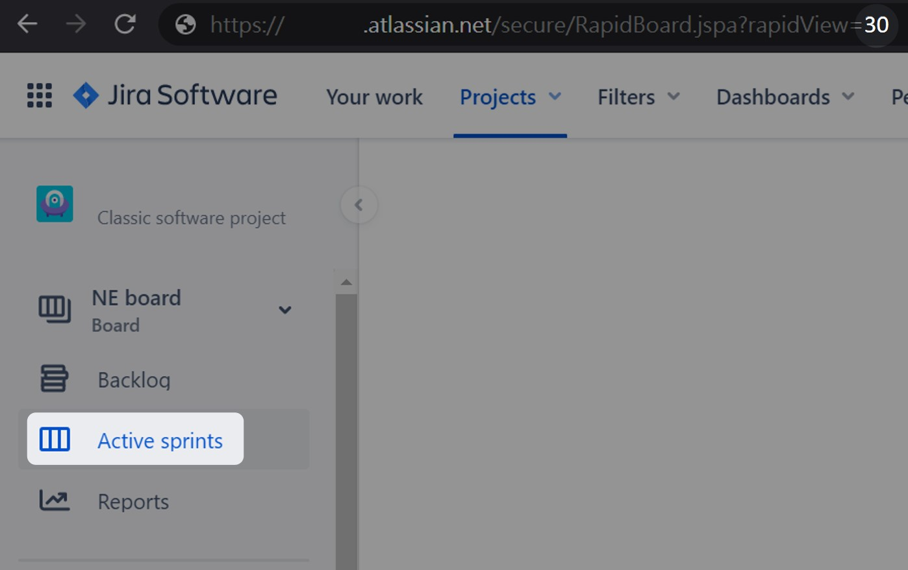

# Github-Jira-Integration

[](https://github.com/Timmatt-Lee/Github-Jira-Integration/releases/latest)

Tired of switching tabs between GitHub and Jira?

With this GitHub Action, a pull request will transit Jira issue and bind links on each other

Resolve it once merged.

## Demo

### Pull Request and Create Jira issue

1. create a pull request
.jpg)
1. auto insert created issue key into title and desc
.jpg)
1. auto create Jira issue with same title
1. and `component`, `fix version`, `active sprint`
1. record github pull request url
.jpg)

### Pull Request with Existed Jira issue

1. here is an existed Jira issue
.jpg)
1. create a pull request titled with Jira issue key
.jpg)
1. auto insert Jira issue link into desc
.jpg)
1. auto transit Jira issue
1. record github pull request url
.jpg)

### Merge and Resolve Jira issue

1. after merging pull request
1. corresponding Jira issue got auto transited
.jpg)

## Usage

### Create GitHub Action

Create `.github/workflows/pr-jira.yml`:

```{yml}
on:
  pull_request:
    types: [opened]
    branches:
      - master

name: Pull Request and Jira issue integration

jobs:
  jira:
    name: Pull Request and Jira issue integration
    runs-on: ubuntu-latest
    steps:
    - name: Pull Request and Jira issue integration
      uses: Timmatt-Lee/Github-Jira-Integration@master
      with:
        host: ${{ secrets.JIRA_BASE_URL }}
        email: ${{ secrets.JIRA_USER_EMAIL }}
        token: ${{ secrets.JIRA_API_TOKEN }}
        githubToken: ${{ secrets.GITHUB_TOKEN }}
        project: ${{ secrets.JIRA_PROJECT_NAME }}
        transition: ${{ secrets.JIRA_PR_TRANSITION_NAME }}
        # required if you want to create issue
        type: ${{ secrets.JIRA_ISSUE_TYPE }}
        # belows are optional, for created issue
        component: ${{ secrets.JIRA_COMPONENT_NAME }}
        version: ${{ secrets.JIRA_VERSION_PREFIX }}
        board: ${{ secrets.JIRA_BOARD_ID }}
        # if you don't want to auto create issue
        isCreateIssue: false
```

Create `.github/workflows/merge-jira.yml`:

```{yml}
on:
  pull_request:
    types: [closed]
    branches:
      - master

name: Merge and resolve Jira issue

jobs:
  jira:
    name: Merge and resolve Jira issue
    if: github.event.pull_request.merged
    runs-on: ubuntu-latest
    steps:
    - name: Transit Jira issue
      uses: Timmatt-Lee/Github-Jira-Integration@master
      with:
        host: ${{ secrets.JIRA_BASE_URL }}
        email: ${{ secrets.JIRA_USER_EMAIL }}
        token: ${{ secrets.JIRA_API_TOKEN }}
        project: ${{ secrets.JIRA_PROJECT_NAME }}
        transition: ${{ secrets.JIRA_MERGE_TRANSITION_NAME }}
        isOnlyTransition: true
```

Create GitHub Secrets

_**NOTE**_: you need admin authorization of your repo

- `JIRA_BASE_URL`: `https://your-domain.atlassian.net`
- `JIRA_USER_EMAIL`: your jira email
- `JIRA_API_TOKEN`: [Create Here](https://id.atlassian.com/manage-profile/security/api-tokens)
- `JIRA_PROJECT_NAME`: short name of your project(eg. `My Project (MP)`, `MP` is the project name)
- `JIRA_ISSUE_TYPE`: eg. `Task`, `Story`...
- `JIRA_BOARD_ID`: for creating issue auto attach to active sprint 
- `JIRA_COMPONENT_NAME`: component name that creating issue attach to
- `JIRA_VERSION_PREFIX `: for creating issue auto attach to fix version that match the prefix. eg. `Backend Cloud v1` 
- `JIRA_MERGE_TRANSITION_NAME`: eg. `Resolve`
- `JIRA_PR_TRANSITION_NAME`: eg. `In Progress`

_**NOTE**_: you can rename yourself, but don't forget to change corresponding argument name in `.yml`
